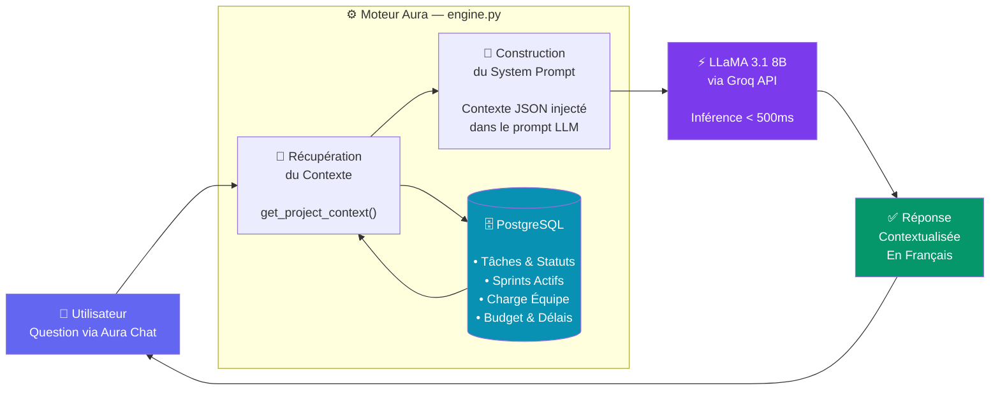
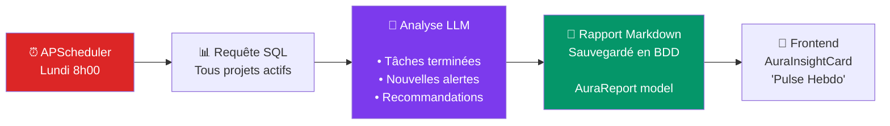

# 🧠 Architecture IA — Aura Intelligence
## Vaerdia ProjectFlow · Soutenance Technique


---

## Flux de Données (Database-Augmented Generation)



---

## Génération Automatique des Rapports



---

## Concept : Database-Augmented Generation (DAG)

> [!IMPORTANT]
> Aura n'utilise **pas** de base vectorielle. C'est un choix architectural justifié.

| Critère | RAG Classique | Aura DAG ✅ |
|---|---|---|
| **Source** | Documents PDF, textes statiques | Base de données PostgreSQL temps réel |
| **Récupération** | Similarité vectorielle (embeddings) | Requêtes SQL ciblées |
| **Fraîcheur** | Dépend de l'indexation | **Toujours à jour** |
| **Précision** | Approximative (top-k chunks) | **Exacte** (données structurées) |
| **Coût** | Base vectorielle (Pinecone ~$70/mois) | **Gratuit** (PostgreSQL existant) |
| **Modèle** | GPT-4, Claude | **LLaMA 3.1 via Groq (Gratuit)** |

---

## Les 4 Capacités Clés d'Aura

```
┌─────────────────────────────────────────────────────────────────┐
│  1. 💬 CHAT CONTEXTUEL         Répond aux questions sur le       │
│                                projet en temps réel              │
│  2. 📈 RAPPORT HEBDOMADAIRE    Analyse et synthèse automatique   │
│                                chaque lundi (APScheduler)        │
│  3. 👥 RECOMMANDATION          Suggère le meilleur membre pour   │
│                                une tâche selon la charge         │
│  4. ✅ SUGGESTION DE TÂCHES    Décompose une User Story en       │
│                                sous-tâches concrètes (Agile)     │
└─────────────────────────────────────────────────────────────────┘
```

---

## Arguments pour la Défense

**Q: Pourquoi pas GPT-4 ou Claude ?**
> LLaMA 3.1 via Groq est **open-source**, **gratuit**, et avec une latence < 500ms. Pour un projet académique, c'est la solution la plus pragmatique.

**Q: Pourquoi pas un vrai RAG avec ChromaDB/Pinecone ?**
> Les données d'un projet (tâches, sprints, membres) sont **structurées et dynamiques**. Les embeddings sont optimaux pour des corpus de textes statiques (documentation, PDF). Notre approche DAG est plus adaptée, plus rapide, et sans coût supplémentaire.

**Q: Comment garantissez-vous la pertinence des réponses ?**
> En injectant le contexte complet du projet dans le System Prompt à chaque requête. Le LLM ne peut répondre qu'avec les données réelles de la BDD — pas d'hallucinations sur les chiffres du projet.

**Q: Comment fonctionne l'isolation des données par projet ?**
> Chaque appel à `get_project_context(project_id)` est scopé au projet sélectionné. Le frontend envoie le `project_id` avec chaque message, et le `auraStore` Zustand maintient un historique séparé par projet (`messagesByProject`).
